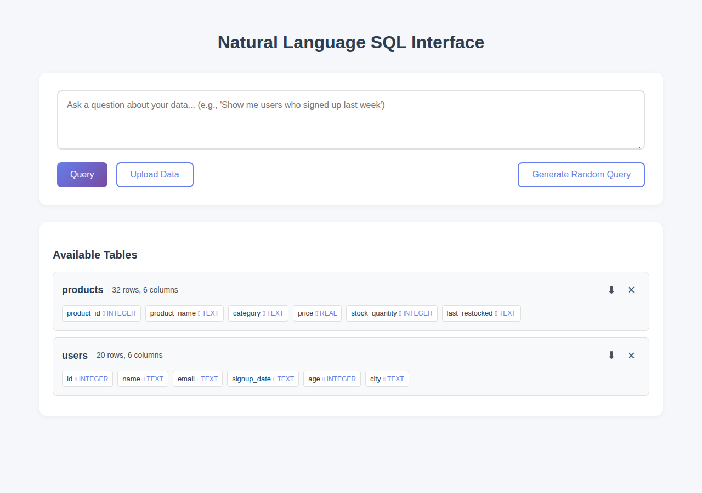
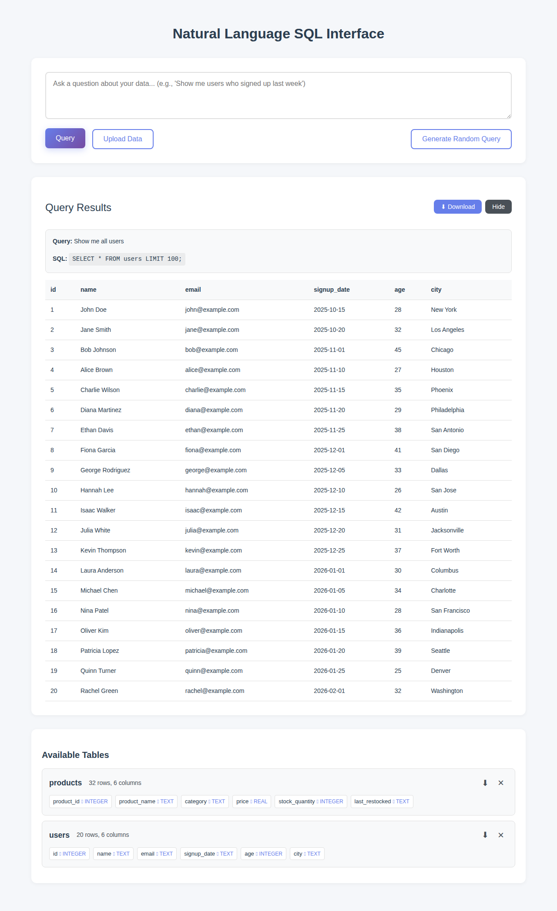
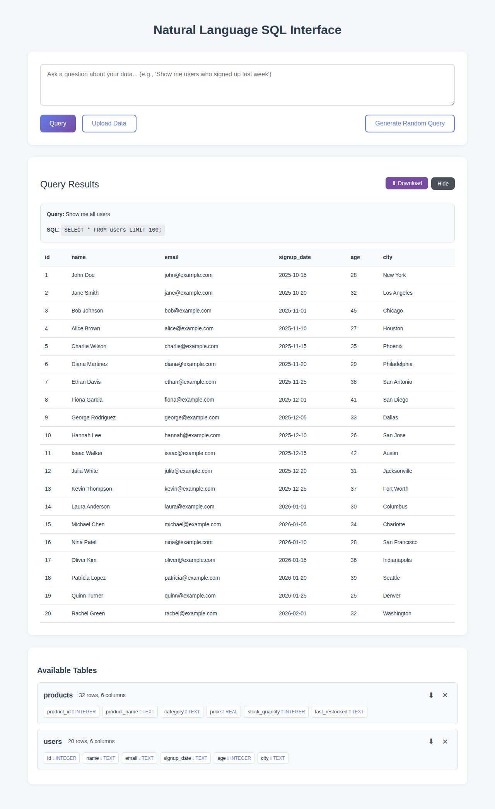

# One Click Table Exports

**ADW ID:** 289be3a6
**Date:** 2025-11-29
**Specification:** specs/issue-1-adw-289be3a6-sdlc_planner-one-click-table-exports.md

## Overview

This feature adds CSV export functionality to the Natural Language SQL Interface application. Users can now export entire database tables and query results as CSV files with a single click, enabling easy data sharing and analysis in external tools like Excel or Google Sheets.

## Screenshots

### Table Export Button

Download buttons appear next to each table in the Available Tables section

### Query Results Export Button

Download button appears in the Query Results section alongside the Hide button

### Complete Feature

Both table and query results export functionality working together

## What Was Built

- Two new CSV export API endpoints
- Download buttons in the UI for tables and query results
- CSV generation with proper escaping for special characters
- Client-side download triggering functionality
- Comprehensive test suite covering edge cases

## Technical Implementation

### Files Modified

- `app/server/server.py`: Added two export endpoints with CSV generation and security validation
- `app/server/core/data_models.py`: Added `ExportResultsRequest` model for POST endpoint
- `app/client/src/api/client.ts`: Added `exportTable()` and `exportResults()` methods
- `app/client/src/main.ts`: Added download buttons to tables list and results header
- `app/client/src/style.css`: Added styles for download buttons
- `app/client/src/types.d.ts`: Added TypeScript interface for export requests
- `app/server/tests/test_export.py`: Created comprehensive test suite with 223 lines of tests
- `.claude/commands/e2e/test_table_exports.md`: Created E2E test documentation

### Key Changes

1. **Export Endpoints**: Implemented `GET /api/export/table/{table_name}` and `POST /api/export/results` using FastAPI's `StreamingResponse` with proper CSV mime types and Content-Disposition headers

2. **Security**: Table names are validated using existing `validate_identifier()` and `check_table_exists()` security utilities to prevent SQL injection

3. **CSV Generation**: Uses Python's built-in `csv` module with `io.StringIO` for memory-efficient CSV generation with automatic escaping of special characters (commas, quotes, newlines)

4. **Client Download Logic**: For table exports, creates temporary anchor elements with download URLs. For results exports, fetches blob response and creates object URLs for download

5. **UI Integration**: Download buttons styled consistently with existing UI elements, positioned to the left of remove/hide buttons as specified

## How to Use

### Exporting a Table

1. Upload a CSV or JSON file to create a table in the Available Tables section
2. Locate the table you want to export in the Available Tables list
3. Click the download button (⬇) to the left of the "x" icon
4. The table will be downloaded as `{table_name}.csv`

### Exporting Query Results

1. Enter a natural language query or click "Random Query" to generate one
2. After the query executes and results appear
3. Click the download button (⬇ Download) in the Query Results header
4. The results will be downloaded as `query_results.csv`

## Configuration

No configuration is required. The feature works with the existing database connection and API configuration.

## Testing

### Unit Tests
Run the test suite to validate export functionality:
```bash
cd app/server && uv run pytest
```

Tests cover:
- Valid table exports
- Non-existent table handling (404)
- Invalid table name security (400)
- Results export with various data shapes
- CSV escaping for special characters
- Empty table/result handling

### E2E Tests
Execute the E2E test to validate full workflow:
```bash
# Follow instructions in .claude/commands/test_e2e.md
# Then execute .claude/commands/e2e/test_table_exports.md
```

### Frontend Build
```bash
cd app/client && bun tsc --noEmit
cd app/client && bun run build
```

## Notes

- CSV files include header rows with column names
- Special characters (commas, quotes, newlines) are properly escaped following RFC 4180 CSV standard
- Large tables are streamed efficiently without loading entire dataset into memory
- Download buttons use Unicode down arrow character (⬇) for simplicity and compatibility
- Security validation ensures only valid table names can be exported, preventing SQL injection attacks
- Empty tables or results export with header row only, which is the correct CSV behavior
